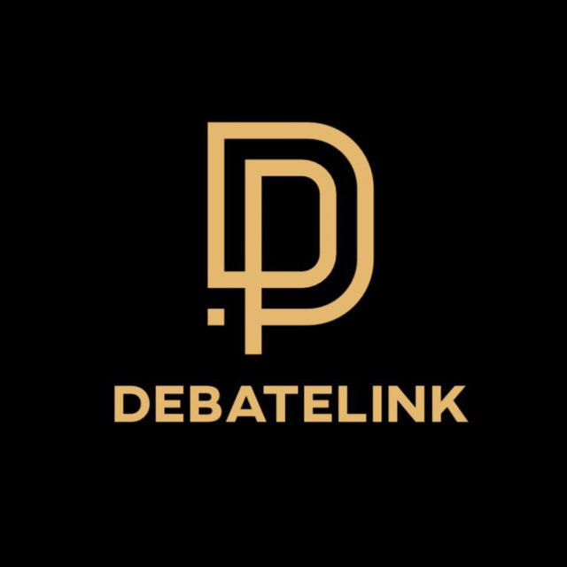

<a id="readme-top"></a>

<!-- PROJECT LOGO -->
<br />
<div align="center">
  <a href="https://github.com/asemaikauas/debatelink">
    
  </a> 

  <h3 align="center">Learn Debates with Debatelink!</h3>

  <p align="center">
    Functional web application where users can learn about the organization's mission, services, and programs — and submit a registration form to express their interest
    <br />
    <br />
    <a href="https://debatelink-2.onrender.com/">Visit Website</a>
    <br />
    <a href="https://youtu.be/-zIKTPEdKto">View Demo</a>
  </p>
</div>

---

<details>
  <summary>Table of Contents</summary>
  <ol>
    <li><a href="#about-the-project">About The Project</a>
      <ul>
        <li><a href="#built-with">Built With</a></li>
      </ul>
    </li>
    <li><a href="#getting-started">Getting Started</a>
      <ul>
        <li><a href="#prerequisites">Prerequisites</a></li>
        <li><a href="#installation">Installation</a></li>
      </ul>
    </li>
    <li><a href="#usage">Usage</a></li>
    <li><a href="#demo">View Demo</a></li>
    <li><a href="#roadmap">Roadmap</a></li>
    <li><a href="#contributing">Contributing</a></li>
    <li><a href="#contact">Contact</a></li>
    <li><a href="#acknowledgments">Acknowledgments</a></li>
  </ol>
</details>

---

## About The Project


**Debatelink** is a web application of my organization that promotes debate education and critical thinking for students across Central Asia. It features a dynamic landing page where users can learn about the mission, achievements, and programs of the organization and leave their interest for events so to get contacted by the organization. It includes: 
- Landing page styled with Bootstrap
- Registration form for capturing participant data
- Admin panel for reviewing submissions (basic authorization setup)
- Data saved locally to data.json
- Designed for outreach in the Central Asian region

<p align="right">(<a href="#readme-top">back to top</a>)</p>

---


### Built With

* [Flask](https://flask.palletsprojects.com/)
* [Bootstrap](https://getbootstrap.com)
* [HTML/CSS/JS](https://developer.mozilla.org/)
* [Jinja2](https://pypi.org/project/Jinja2/)
* [JSON](https://developer.mozilla.org/en-US/docs/Learn_web_development/Core/Scripting/JSON)

<p align="right">(<a href="#readme-top">back to top</a>)</p>

---

## Getting Started

### Prerequisites

You’ll need:
- Python 3.8+

### Installation

1. Clone the repo  
   ```bash
   git clone https://github.com/asemaikauas/debatelink.git
   cd debatelink
   ```

2. Set up a virtual environment  
   ```bash
   python -m venv venv
   source venv/bin/activate  # On Windows: venv\Scripts\activate
   ```

3. Install dependencies  
   ```bash
   pip install -r requirements.txt
   ```

4. Through the terminal, run the app  
   ```bash
   flask run
   ```

5. Visit `http://127.0.0.1:5000`

<p align="right">(<a href="#readme-top">back to top</a>)</p>

---

## Usage

1. Open the home page to explore information about Debatelink and upcoming programs.
2. Users can fill out the registration form to express interest in joining. 
3. Admins can log in to the admin panel to view submitted registrations.
4. All form data is stored in a local data.json file.

<p align="right">(<a href="#readme-top">back to top</a>)</p>

---

## Demo

Watch a quick walkthrough of the application:

[](https://youtu.be/-zIKTPEdKto)

<p align="right">(<a href="#readme-top">back to top</a>)</p>


---

## Roadmap

- [ ] Enable email confirmation for registration
- [ ] Migrate from JSON to a relational database (e.g., SQLite or PostgreSQL)
- [ ] Add export-to-CSV feature for admin panel
- [ ] Implement secure admin login system
- [ ] Create an event registration system:
  - [ ] Allow verified organizers to post debate tournaments
  - [ ] Let users view, filter, and register for events
  - [ ] Track registrations per event for both users and organizers


<p align="right">(<a href="#readme-top">back to top</a>)</p>

---

## Contributing

Contributions are what make the open source world amazing!  

1. Fork the repo  
2. Create a feature branch  
   ```bash
   git checkout -b feature/AmazingFeature
   ```
3. Commit your changes  
4. Push and open a PR  
5. 🌟 Star the project!

<p align="right">(<a href="#readme-top">back to top</a>)</p>

---

## Contact

Asemai – kauasasemai05@gmail.com  
Project Link: [https://github.com/asemaikauas](https://github.com/asemaikauas)

<p align="right">(<a href="#readme-top">back to top</a>)</p>

---

## Acknowledgments

* [Best-README-Template](https://github.com/othneildrew/Best-README-Template)
* [Flask](https://flask.palletsprojects.com/en/stable/)
* [Bootstrap](https://getbootstrap.com)
* [Font Awesome](https://fontawesome.com)
* All educators and students who inspired this platform 💙


<p align="right">(<a href="#readme-top">back to top</a>)</p>
